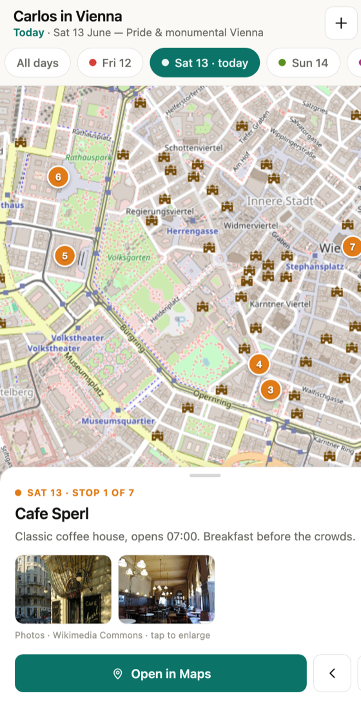
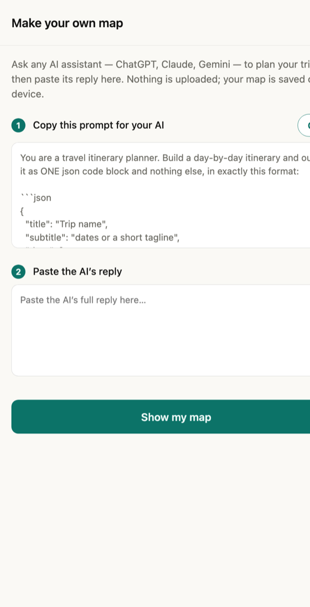

# Itinerary Map

A tiny, installable travel-map app you build by talking to **any** AI assistant.
Ask ChatGPT, Claude, or Gemini to plan a trip, paste its reply, and get a
mobile, offline-capable map of your days — with photos and directions.

**▶ Live demo:** https://sergfv.github.io/vienna-itinerary-map/
(opens a sample Vienna itinerary — tap **＋** to make your own)

No accounts, no servers, no app store. It's a single static page that runs
entirely in the browser and installs to your home screen as a PWA.

<p align="center">
  
  &nbsp;
  
</p>

---

## What it does

- **Day-by-day map** — colour-coded pins per day; tap a day to focus it, or see them all.
- **Stop cards** — a bottom sheet with notes, step through each day in order, and a one-tap **Open in Maps**.
- **Photos** — each place shows a few images pulled live from Wikipedia; tap to open a swipe + pinch-zoom lightbox.
- **Opens on today** — if your trip is in progress, it lands on the current day.
- **Make your own** — paste an AI's reply to generate your map (see below).
- **Share** — pack a whole itinerary into a single link and send it; the recipient just taps it.
- **Offline** — the app shell is cached, so it opens and works without signal (map tiles and photos need a connection).

## Make your own in three steps

1. Open the app and tap **＋ → Copy** to grab the prompt.
2. Paste it into your preferred AI assistant and describe your trip.
3. Paste the AI's reply back into the app → **Show my map**. It's saved on your device.

Nothing is uploaded — your itinerary lives in your browser (and in share links you choose to create).

<details>
<summary>The prompt (also built into the app)</summary>

The app asks the AI for a small JSON itinerary:

```json
{
  "title": "Trip name",
  "subtitle": "dates or a short tagline",
  "days": [
    {
      "label": "Mon 1",
      "name": "Mon 1 — morning theme",
      "date": "2026-07-01",
      "stops": [
        { "name": "Place", "note": "Why go, timing, a tip.", "lat": 0.0, "lng": 0.0, "wiki": "Wikipedia article title" }
      ]
    }
  ]
}
```

Colours and ids are assigned by the app, so the AI only supplies content. The
optional `wiki` title is what lets a stop show photos.
</details>

## Design & engineering notes

This started as a one-off itinerary for a single trip and was generalised into a
reusable tool. A few decisions worth calling out:

- **Paste, not integrations.** The lowest common denominator every AI assistant
  can do is "follow a format and return text." So the handoff is a copy-paste of
  the AI's reply — it works the same in ChatGPT, Claude, Gemini, or anything
  else, with zero per-tool setup. A one-tap share link covers re-opening and
  sending to others.
- **Built for a non-technical traveller.** No GitHub, no files, no JSON
  knowledge required — the prompt is embedded in the app, the import is lenient
  (it pulls the JSON out of a full chat reply), and bad input gets a friendly
  message instead of a blank screen.
- **Untrusted data is treated as untrusted.** Once anyone's itinerary can be
  loaded, all text is HTML-escaped at render, coordinates are validated, and
  image URLs are restricted to Wikimedia.
- **Photos without curation.** Rather than hardcoding image URLs, a stop names a
  Wikipedia article and the app fetches the editor-chosen lead image (plus a few
  relevant extras) on demand — so it works for any place in the world.
- **Calm visual system.** Warm paper surfaces, flat fills, a single accent
  colour for anything interactive, and categorical colours for days.

## How it works

Plain vanilla JavaScript — **no build step, no framework.**

- **[Leaflet](https://leafletjs.com/)** with the **CARTO Voyager** basemap (OpenStreetMap data) — free, no API key.
- **Wikipedia / Wikimedia Commons** APIs for photos (fetched client-side).
- **[lz-string](https://github.com/pieroxy/lz-string)** to compress an itinerary into a share link.
- A **service worker** precaches the app shell for offline use.
- Hosted free on **GitHub Pages**.

| File | Role |
|------|------|
| `index.html` | Markup shell |
| `style.css` | The visual system |
| `app.js` | The engine: data loading, rendering, import, share, photos |
| `data.js` | The built-in demo itinerary (`TRIP`) + its curated photos |
| `sw.js` | Service worker (offline cache) |

## Run locally

No dependencies — just serve the folder over HTTP:

```bash
python3 -m http.server 8000
# then open http://localhost:8000
```

## Credits

- Maps © [OpenStreetMap](https://www.openstreetmap.org/copyright) contributors, tiles by [CARTO](https://carto.com/attributions).
- Photos from [Wikimedia Commons](https://commons.wikimedia.org/) (each links to its source/licence).
- Built with [Leaflet](https://leafletjs.com/) and [lz-string](https://github.com/pieroxy/lz-string).

## License

[MIT](LICENSE)
